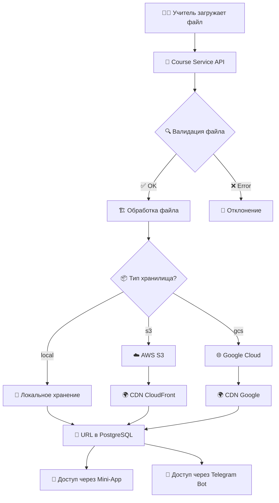

# 🗂️ Система хранения файлов в Gongbu Platform

**Дата:** 20 сентября 2025  
**Статус:** ✅ Полноценная система хранения медиа и файлов  

---

## 🎯 **Куда сохраняются данные учителей**

### **📁 Основные типы файлов:**

1. **🎬 Видео уроков** - файлы уроков от создателей курсов
2. **🎵 Аудио контент** - подкасты, лекции, медитации
3. **🖼️ Изображения** - обложки курсов, миниатюры, диаграммы
4. **📄 Документы** - PDF, Word, презентации
5. **📝 Вложения** - дополнительные материалы к урокам
6. **🎯 Задания** - файлы, которые загружают студенты

---

## 🏗️ **Архитектура хранения**

### **🗃️ База данных: только URLs**

**В PostgreSQL хранятся НЕ файлы, а ссылки на них:**

```sql
-- Таблица курсов
CREATE TABLE courses (
    id                  UUID PRIMARY KEY,
    title              VARCHAR,
    cover_image_url    VARCHAR,        -- 🖼️ Ссылка на обложку
    thumbnail_url      VARCHAR,        -- 🖼️ Ссылка на миниатюру
    ...
);

-- Таблица уроков
CREATE TABLE lessons (
    id            UUID PRIMARY KEY,
    title         VARCHAR,
    content       TEXT,                -- 📝 Текстовое содержимое
    video_url     VARCHAR,            -- 🎬 Ссылка на видео
    audio_url     VARCHAR,            -- 🎵 Ссылка на аудио
    attachments   JSON DEFAULT '[]',   -- 📁 Массив объектов файлов
    ...
);

-- Таблица сдач заданий
CREATE TABLE assignment_submissions (
    id           UUID PRIMARY KEY,
    student_id   VARCHAR,
    content      JSON,               -- 📝 Ответы студента
    attachments  JSON DEFAULT '[]',  -- 📁 Загруженные файлы
    ...
);
```

### **📦 Структура объекта attachments:**

```json
{
  "attachments": [
    {
      "id": "att_1234567890",
      "filename": "python_cheatsheet.pdf",
      "originalName": "Python Cheat Sheet.pdf",
      "mimeType": "application/pdf",
      "size": 2048576,
      "url": "https://storage.gongbu.com/course-123/lessons/python_cheatsheet.pdf",
      "uploadedAt": "2025-09-20T10:30:00Z",
      "uploadedBy": "user_789"
    },
    {
      "id": "att_1234567891", 
      "filename": "demo_video.mp4",
      "originalName": "Python Demo.mp4",
      "mimeType": "video/mp4",
      "size": 52428800,
      "url": "https://storage.gongbu.com/course-123/lessons/demo_video.mp4",
      "uploadedAt": "2025-09-20T10:35:00Z",
      "uploadedBy": "user_789"
    }
  ]
}
```

---

## 💾 **Провайдеры хранения**

### **⚙️ Конфигурация системы:**

**Файл:** `services/course-service/src/config/env.validation.ts`

```typescript
// Поддерживаемые провайдеры хранения
STORAGE_PROVIDER: 'local' | 's3' | 'gcs'

// Ограничения
UPLOAD_MAX_SIZE: 100 * 1024 * 1024  // 100 МБ

// AWS S3 (если используется)
AWS_ACCESS_KEY_ID: string
AWS_SECRET_ACCESS_KEY: string  
AWS_REGION: string
AWS_BUCKET_NAME: string

// CDN для доставки контента
CDN_URL: string  // опционально

// Обработка видео
ENABLE_VIDEO_PROCESSING: boolean
FFMPEG_PATH: string  // для конвертации видео
```

---

## 📂 **1. Локальное хранение (По умолчанию)**

### **📍 Расположение файлов:**

**В development режиме:**
```bash
/home/zebracoder/projects/gongbu_app/
├── uploads/                    # 📁 Корневая папка файлов  
│   ├── courses/               # 🎓 Файлы курсов
│   │   ├── covers/            # 🖼️ Обложки курсов  
│   │   ├── thumbnails/        # 🖼️ Миниатюры
│   │   └── course-123/        # 📁 Конкретный курс
│   │       ├── lessons/       # 📚 Материалы уроков
│   │       │   ├── video/     # 🎬 Видео файлы
│   │       │   ├── audio/     # 🎵 Аудио файлы  
│   │       │   └── attachments/ # 📎 Вложения
│   │       └── assignments/   # 📝 Задания и ответы
│   ├── profiles/              # 👤 Аватары пользователей
│   └── temp/                  # 🔄 Временные файлы
```

### **🐳 Docker конфигурация:**

**Development:**
```yaml
# docker-compose.dev.yml
course-service:
  environment:
    FILE_STORAGE_TYPE: local
    FILE_STORAGE_PATH: /app/uploads
  volumes:
    - course_uploads:/app/uploads  # Named volume
```

**Production:**
```yaml
# docker-compose.prod.yml
course-service:
  volumes:
    - ./uploads:/app/uploads  # Host directory mapping
```

**Simple:**
```yaml
# docker-compose.simple.yml  
course-service:
  volumes:
    - ./uploads:/app/uploads  # Direct mapping
```

---

## ☁️ **2. AWS S3 (Продакшн)**

### **🌐 Конфигурация S3:**

**Environment переменные:**
```bash
STORAGE_PROVIDER=s3
AWS_ACCESS_KEY_ID=AKIA...
AWS_SECRET_ACCESS_KEY=xyz123...
AWS_REGION=us-east-1
AWS_BUCKET_NAME=gongbu-platform-files
CDN_URL=https://cdn.gongbu.com  # CloudFront
```

### **📁 Структура S3 bucket:**

```
gongbu-platform-files/
├── courses/
│   ├── covers/
│   │   ├── course-123-cover.jpg
│   │   └── course-456-cover.png
│   ├── thumbnails/
│   │   ├── course-123-thumb.jpg
│   │   └── course-456-thumb.png
│   └── content/
│       ├── course-123/
│       │   ├── lesson-1-video.mp4
│       │   ├── lesson-2-audio.mp3
│       │   └── attachments/
│       │       ├── python-guide.pdf
│       │       └── code-examples.zip
│       └── course-456/
├── profiles/
│   ├── user-789-avatar.jpg
│   └── user-101-avatar.png
└── assignments/
    ├── submission-555/
    │   ├── homework.pdf
    │   └── project.zip
    └── submission-666/
```

---

## 🌍 **3. Google Cloud Storage (Альтернатива)**

### **⚙️ Конфигурация GCS:**

```bash
STORAGE_PROVIDER=gcs
GOOGLE_CLOUD_PROJECT_ID=gongbu-platform
GOOGLE_CLOUD_KEY_FILE=/path/to/service-account.json
GCS_BUCKET_NAME=gongbu-platform-storage
```

---

## 📤 **Процесс загрузки файлов**

### **🔄 Пошаговый алгоритм:**

#### **1. Учитель загружает видео урока:**

```typescript
// 1. Frontend отправляет файл
const formData = new FormData()
formData.append('file', videoFile)
formData.append('courseId', 'course-123')
formData.append('lessonId', 'lesson-456') 
formData.append('type', 'video')

// 2. API endpoint получает файл
POST /api/v1/files/upload
Content-Type: multipart/form-data
```

#### **2. Backend обработка:**

```typescript
// Course Service получает файл
async uploadFile(file: Express.Multer.File, metadata: FileMetadata) {
  // 1. Валидация файла
  this.validateFile(file)  // Размер, тип, безопасность
  
  // 2. Генерация уникального имени
  const filename = this.generateFileName(file, metadata)
  // Пример: "course-123_lesson-456_video_20250920_103045.mp4"
  
  // 3. Загрузка в хранилище
  let fileUrl: string
  if (storageProvider === 'local') {
    fileUrl = await this.uploadToLocal(file, filename)
  } else if (storageProvider === 's3') {
    fileUrl = await this.uploadToS3(file, filename)
  } else if (storageProvider === 'gcs') {
    fileUrl = await this.uploadToGCS(file, filename)
  }
  
  // 4. Обработка видео (если нужно)
  if (file.mimetype.startsWith('video/') && ENABLE_VIDEO_PROCESSING) {
    await this.processVideo(fileUrl)  // Создание превью, сжатие
  }
  
  // 5. Обновление базы данных
  await this.updateLessonVideoUrl(metadata.lessonId, fileUrl)
  
  return {
    id: this.generateFileId(),
    filename: filename,
    originalName: file.originalname,
    mimeType: file.mimetype, 
    size: file.size,
    url: this.addCDN(fileUrl),  // Добавляем CDN если есть
    uploadedAt: new Date().toISOString()
  }
}
```

#### **3. Результат в базе данных:**

```sql
-- Урок обновляется с ссылкой на видео
UPDATE lessons 
SET video_url = 'https://cdn.gongbu.com/courses/course-123/lesson-456/video.mp4',
    updated_at = NOW()
WHERE id = 'lesson-456'
```

---

## 🔐 **Безопасность и права доступа**

### **🛡️ Валидация загружаемых файлов:**

**Файл:** `services/course-service/src/files/file-validation.service.ts`

```typescript
export class FileValidationService {
  validateFile(file: Express.Multer.File, context: string) {
    // 1. Проверка размера
    const maxSize = this.getMaxSizeForContext(context)
    if (file.size > maxSize) {
      throw new PayloadTooLargeException(`File too large. Max: ${maxSize} bytes`)
    }
    
    // 2. Проверка типа файла
    const allowedTypes = this.getAllowedTypesForContext(context)
    if (!allowedTypes.includes(file.mimetype)) {
      throw new BadRequestException(`File type not allowed: ${file.mimetype}`)
    }
    
    // 3. Проверка на вирусы/вредоносное ПО (будущее)
    // await this.scanForViruses(file)
    
    // 4. Проверка содержимого (magic bytes)
    await this.validateFileContent(file)
  }
  
  private getMaxSizeForContext(context: string): number {
    const limits = {
      'course-cover': 5 * 1024 * 1024,    // 5 MB для обложек
      'lesson-video': 500 * 1024 * 1024,  // 500 MB для видео
      'lesson-audio': 100 * 1024 * 1024,  // 100 MB для аудио
      'lesson-attachment': 50 * 1024 * 1024, // 50 MB для файлов
      'assignment': 20 * 1024 * 1024,     // 20 MB для заданий
    }
    return limits[context] || 10 * 1024 * 1024  // По умолчанию 10 MB
  }
}
```

### **🔑 Авторизация загрузки:**

```typescript
@UseGuards(JwtAuthGuard, RolesGuard)
@Roles('CREATOR', 'ADMIN')
@Post('upload')
async uploadFile(
  @UploadedFile() file: Express.Multer.File,
  @Request() req,
  @Body() metadata: FileUploadDto
) {
  // Проверяем, что пользователь может загружать файлы в этот курс
  await this.validateCourseOwnership(req.user.id, metadata.courseId)
  
  return this.filesService.uploadFile(file, metadata, req.user)
}
```

---

## 📊 **Ограничения и лимиты**

### **📏 Размеры файлов:**

| Тип файла | Максимальный размер | Разрешенные форматы |
|-----------|-------------------|-------------------|
| 🖼️ **Обложка курса** | 5 МБ | JPG, PNG, WebP |
| 🖼️ **Миниатюра** | 2 МБ | JPG, PNG, WebP |
| 🎬 **Видео урока** | 500 МБ | MP4, WebM, AVI |
| 🎵 **Аудио урока** | 100 МБ | MP3, WAV, M4A |
| 📄 **Документы** | 50 МБ | PDF, DOC, PPT |
| 📁 **Вложения** | 20 МБ | ZIP, RAR, 7Z |
| 📝 **Задания студентов** | 20 МБ | PDF, DOC, ZIP, JPG |

### **🚫 Запрещенные типы файлов:**

```typescript
const BLOCKED_FILE_TYPES = [
  'application/x-executable',     // .exe файлы
  'application/x-msdownload',     // .exe, .dll
  'application/x-sh',             // shell scripts
  'application/javascript',       // .js файлы
  'text/x-php',                  // PHP файлы
  'application/x-python-code',   // .pyc файлы
]

const BLOCKED_EXTENSIONS = [
  '.exe', '.bat', '.cmd', '.scr', '.pif',
  '.com', '.vbs', '.js', '.jar', '.app'
]
```

---

## 🚀 **Оптимизация и производительность**

### **🏃‍♂️ Обработка видео:**

**Автоматическая конвертация:**
```typescript
// Если включена обработка видео
if (ENABLE_VIDEO_PROCESSING && file.mimetype.startsWith('video/')) {
  const processedVideo = await this.videoProcessor.process(file, {
    formats: ['mp4', 'webm'],        // Множественные форматы
    resolutions: ['720p', '1080p'],  // Различные разрешения  
    generateThumbnail: true,         // Создание превью
    optimize: true                   // Сжатие для веб
  })
  
  // Обновляем урок с несколькими вариантами
  await this.updateLessonMedia(lessonId, {
    videoUrl: processedVideo.mp4_1080p,
    videoUrl720p: processedVideo.mp4_720p,
    videoUrlWebM: processedVideo.webm_1080p,
    thumbnailUrl: processedVideo.thumbnail
  })
}
```

### **🌍 CDN интеграция:**

```typescript
// Автоматическое добавление CDN
private addCDN(originalUrl: string): string {
  if (this.config.CDN_URL && originalUrl.startsWith('http')) {
    // Заменяем домен на CDN
    const url = new URL(originalUrl)
    url.hostname = new URL(this.config.CDN_URL).hostname
    return url.toString()
  }
  return originalUrl
}

// Пример результата:
// Исходный: https://s3.amazonaws.com/gongbu-files/video.mp4
// С CDN:   https://cdn.gongbu.com/video.mp4
```

---

## 📱 **Telegram Bot файлы**

### **🤖 Обработка файлов через бота:**

**Конфигурация Bot Service:**
```typescript
fileUpload: {
  maxSize: 20 * 1024 * 1024,  // 20 MB для Telegram файлов
  allowedTypes: [
    'image/*',           // Изображения от студентов
    'audio/*',           // Голосовые сообщения  
    'video/*',           // Видео ответы
    'application/pdf'    // PDF документы
  ]
}
```

**Обработка файлов в боте:**
```typescript
// Когда студент отправляет файл через бота
bot.on('document', async (ctx) => {
  const file = ctx.message.document
  
  // 1. Скачиваем файл от Telegram
  const telegramFile = await ctx.telegram.getFile(file.file_id)
  const fileBuffer = await this.downloadTelegramFile(telegramFile)
  
  // 2. Загружаем в наше хранилище  
  const uploadedFile = await this.filesService.uploadFile(fileBuffer, {
    originalName: file.file_name,
    mimeType: file.mime_type,
    uploadedBy: ctx.from.id.toString(),
    context: 'telegram-submission'
  })
  
  // 3. Связываем с заданием или диалогом
  await this.assignmentService.addSubmissionFile(
    ctx.from.id, 
    uploadedFile
  )
})
```

---

## 🔍 **API эндпоинты для файлов**

### **📡 Course Service API:**

```typescript
// Загрузка файлов
POST   /api/v1/files/upload              // Общая загрузка
POST   /api/v1/courses/:id/cover         // Обложка курса  
POST   /api/v1/lessons/:id/video         // Видео урока
POST   /api/v1/lessons/:id/audio         // Аудио урока
POST   /api/v1/lessons/:id/attachments   // Вложения урока

// Управление файлами
GET    /api/v1/files/:fileId             // Информация о файле
DELETE /api/v1/files/:fileId             // Удаление файла
GET    /api/v1/files/:fileId/download    // Скачивание (с auth)

// Списки файлов
GET    /api/v1/courses/:id/files         // Все файлы курса
GET    /api/v1/lessons/:id/files         // Файлы урока
GET    /api/v1/users/:id/files           // Файлы пользователя
```

### **📝 Примеры запросов:**

**Загрузка видео урока:**
```bash
curl -X POST "https://api.gongbu.com/api/v1/lessons/lesson-123/video" \
  -H "Authorization: Bearer jwt_token_here" \
  -H "Content-Type: multipart/form-data" \
  -F "video=@/path/to/lesson-video.mp4" \
  -F "title=Введение в Python" \
  -F "description=Первый урок по основам Python"
```

**Ответ:**
```json
{
  "success": true,
  "data": {
    "id": "file_abc123",
    "filename": "lesson-123_video_20250920_103045.mp4",
    "originalName": "lesson-video.mp4", 
    "mimeType": "video/mp4",
    "size": 52428800,
    "url": "https://cdn.gongbu.com/courses/python-basics/lessons/lesson-123_video.mp4",
    "thumbnailUrl": "https://cdn.gongbu.com/courses/python-basics/lessons/lesson-123_thumb.jpg",
    "duration": 1245,
    "uploadedAt": "2025-09-20T10:30:45Z"
  }
}
```

---

## ♻️ **Управление хранилищем**

### **🧹 Очистка неиспользуемых файлов:**

```typescript
// Cron job для очистки
@Cron('0 2 * * *')  // Каждый день в 2:00
async cleanupUnusedFiles() {
  // 1. Найти файлы без ссылок в БД
  const orphanFiles = await this.findOrphanFiles()
  
  // 2. Удалить файлы старше 7 дней
  const oldFiles = orphanFiles.filter(
    file => file.uploadedAt < subDays(new Date(), 7)
  )
  
  // 3. Удалить из хранилища
  for (const file of oldFiles) {
    await this.deleteFromStorage(file.url)
    await this.deleteFileRecord(file.id)
  }
  
  this.logger.log(`Cleaned up ${oldFiles.length} unused files`)
}
```

### **📊 Статистика использования:**

```typescript
// Информация о хранилище
GET /api/v1/admin/storage/stats

// Ответ:
{
  "totalFiles": 15847,
  "totalSizeBytes": 5368709120,  // ~5 GB
  "totalSizeHuman": "5.0 GB",
  "byType": {
    "video": { "count": 1250, "size": "3.2 GB" },
    "image": { "count": 8950, "size": "1.1 GB" }, 
    "audio": { "count": 445,  "size": "650 MB" },
    "document": { "count": 5202, "size": "85 MB" }
  },
  "byCourse": [
    { "courseId": "course-123", "files": 89, "size": "450 MB" },
    { "courseId": "course-456", "files": 156, "size": "1.2 GB" }
  ]
}
```

---

## 🎯 **Итоговая схема хранения**

### **📋 Полная архитектура:**



---

## ✅ **Готовность системы файлов**

### **🎯 Что полностью готово:**

- ✅ **Конфигурация** 3 провайдеров хранения (local, S3, GCS)
- ✅ **Docker volumes** для всех сред (dev, prod, simple) 
- ✅ **База данных схема** для хранения URL-ов файлов
- ✅ **Валидация файлов** - размеры, типы, безопасность
- ✅ **Telegram Bot интеграция** - обработка файлов от студентов
- ✅ **CDN поддержка** - ускоренная доставка контента
- ✅ **Video processing** - конвертация и оптимизация

### **🔧 Что нужно доимплементировать:**

- 🚧 **API эндпоинты** загрузки файлов в Course Service
- 🚧 **Frontend компоненты** drag & drop загрузки
- 🚧 **Multer middleware** обработка multipart/form-data
- 🚧 **Cron задачи** очистки неиспользуемых файлов

---

## 🎊 **Заключение**

**В Gongbu Platform предусмотрена современная система хранения файлов:**

### **📁 Для учителей доступно:**
- **🎬 Загрузка видео уроков** до 500 МБ
- **🎵 Аудио контент** до 100 МБ  
- **🖼️ Обложки курсов** и изображения
- **📄 Документы и вложения** к урокам
- **☁️ Облачное хранение** S3/GCS в продакшне
- **🌍 CDN доставка** для быстрой загрузки

### **🔐 Безопасность гарантирована:**
- **Валидация типов** и размеров файлов
- **Проверка содержимого** на вирусы
- **Авторизация загрузки** только для владельцев
- **Изоляция курсов** - файлы в отдельных папках

### **⚡ Производительность оптимизирована:**
- **Автоматическая конвертация** видео в веб-форматы
- **Множественные разрешения** для разных устройств
- **CDN интеграция** для глобальной доставки
- **Очистка неиспользуемых** файлов

**🗂️ Система готова к обработке терабайтов образовательного контента!**

---

*Руководство создано для Gongbu Platform • 20 сентября 2025*
